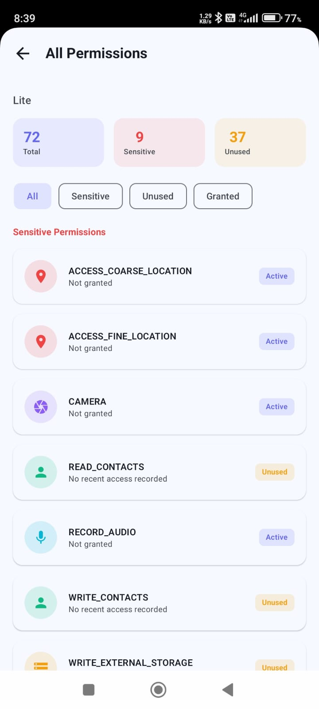
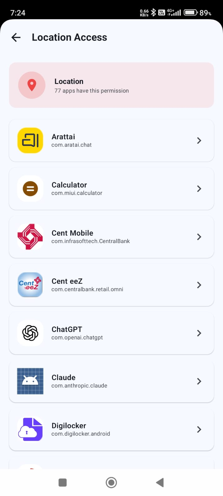
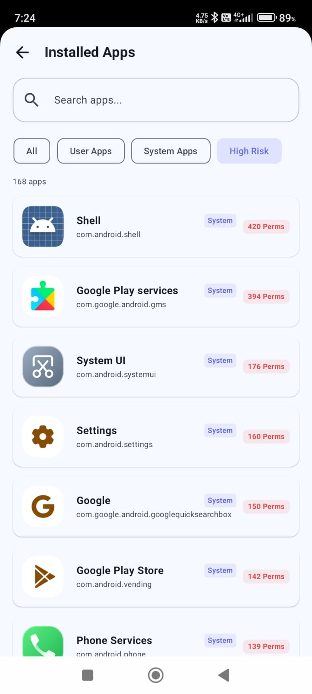
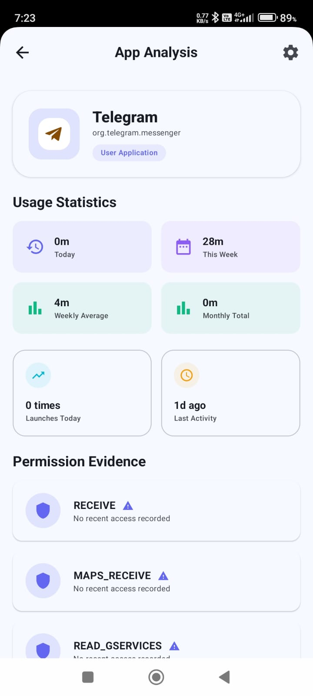
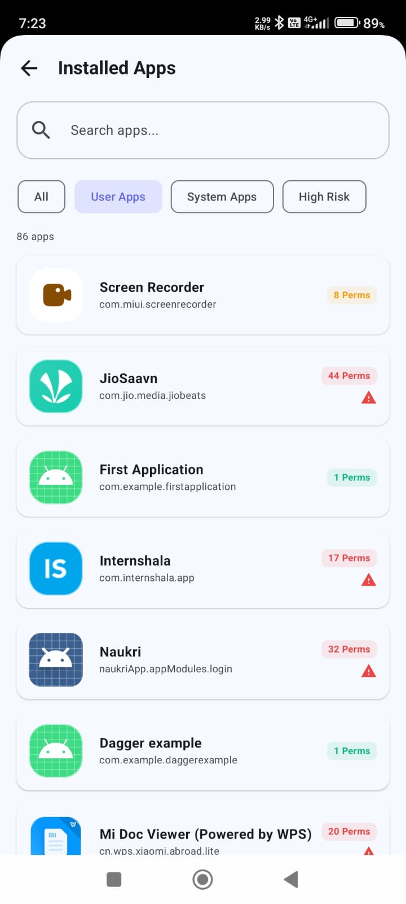
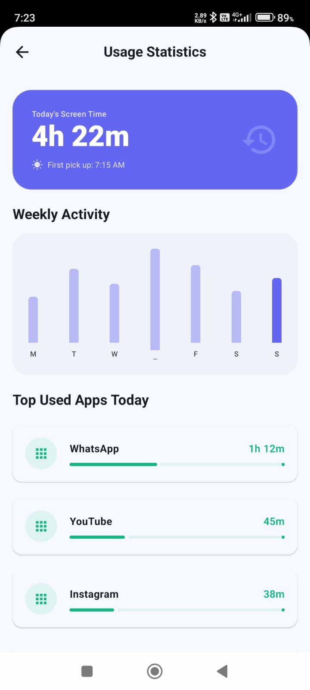
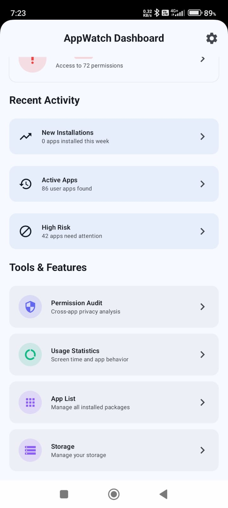
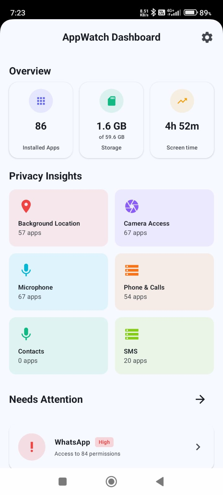

# AppWatch 🛡️
### Android App Intelligence & Privacy Monitor

AppWatch is a system-level Android app that gives you complete visibility into how apps on your device truly behave behind the scenes. Most users grant permissions without ever knowing which apps actually use them, when they were last accessed, or how much time they consume daily. AppWatch surfaces all of this by tracking real-time usage patterns, monitoring sensitive data access via system-level APIs, and exposing apps that silently read your clipboard or access your camera and microphone without your awareness. Everything runs completely offline with no internet permission required and your data never leaves your device.

---

## 📸 Screenshots

<table>
  <tr>
    <td></td>
    <td></td>
    <td></td>
    <td></td>
  </tr>
  <tr>
    <td></td>
    <td></td>
    <td></td>
    <td></td>
  </tr>
</table>


---

## ✨ Features

### 📊 App Usage Dashboard

Provides an immediate overview of total apps, storage health, and daily screen time. It solves the "hidden usage" problem by showing exactly how much time is being spent on the device at a glance.

### 🛡️ Grouped Permission Audit

Organizes apps into categories like Camera, Microphone, and SMS using sticky headers. It solves the navigation struggle by making it easy to find and review every app that holds a specific sensitive power.

### 💤 Inactive App Monitor

Identifies apps that have not been opened in the last 30+, 60+, or 90+ days. It solves the "forgotten risk" problem by flagging apps that still hold sensitive permissions despite being unused for months.

### ⚙️ System App Audit

Audits all pre-installed system-level applications to reveal which built-in apps are using which permissions. It helps you understand what factory-installed apps are doing and which permissions they really use.

### 📱 Detailed App Analysis

A deep-dive view showing exactly how many times an app was launched today, along with a precise breakdown of screen time per day, week, and month.It clearly shows how much you use an app by tracking daily launches and total screen time.

---

## 🛠️ Tech Stack

| Category | Technologies |
|----------|-------------|
| **Language** | Kotlin |
| **UI** | Jetpack Compose, Material 3 |
| **Architecture** | Clean Architecture, MVVM |
| **Dependency Injection** | Hilt |
| **Local Storage** | Room Database |
| **Async** | Kotlin Coroutines, Kotlin Flows |
| **System APIs** | UsageStatsManager, AppOpsManager, PackageManager |
| **Build** | Gradle, Android Studio |

---

## 🏗️ Architecture

AppWatch is built on **Clean Architecture** with **MVVM** at the presentation layer. The codebase is divided into three strict layers data, domain, and presentation and with dependencies only pointing inward. The domain layer has zero dependencies on Android framework classes, making business logic independently testable.

The data layer interacts with Android system APIs and the local Room database. Use cases in the domain layer encapsulate all business logic and are the only bridge between data and presentation. ViewModels expose state via `StateFlow` and the Compose UI observes and reacts to state changes. Hilt manages dependency injection across all layers.

---

## 🔐 Permissions Required

AppWatch requires the following special permission to function:

| Permission | Purpose | How to Grant |
|------------|---------|--------------|
| `PACKAGE_USAGE_STATS` | Access per-app usage and sensitive access data | Settings → Apps → Special App Access → Usage Access → AppWatch → Allow |

> ⚠️ **Important:** `PACKAGE_USAGE_STATS` is a special permission that Android does not grant via a runtime dialog. On first launch, AppWatch detects if the permission is missing and redirects you directly to the correct system settings screen where you can enable it manually with one tap.

---

## 🚀 Getting Started

### Prerequisites
- Android Studio Hedgehog or later
- Android device or emulator running **API 26 (Android 8.0)** or higher

### Installation

1. Clone the repository
```bash
git clone https://github.com/EkagraS/AppWatch.git
```

2. Open the project in Android Studio

3. Build and run on your device
```bash
./gradlew assembleDebug
```

4. On first launch, grant the **Usage Access** permission when prompted — AppWatch will guide you directly to the right settings screen

---

## 👨‍💻 Author

**Ekagra Shandilya**
[LinkedIn](https://www.linkedin.com/in/ekagra-shandilya) • [GitHub](https://github.com/EkagraS)
